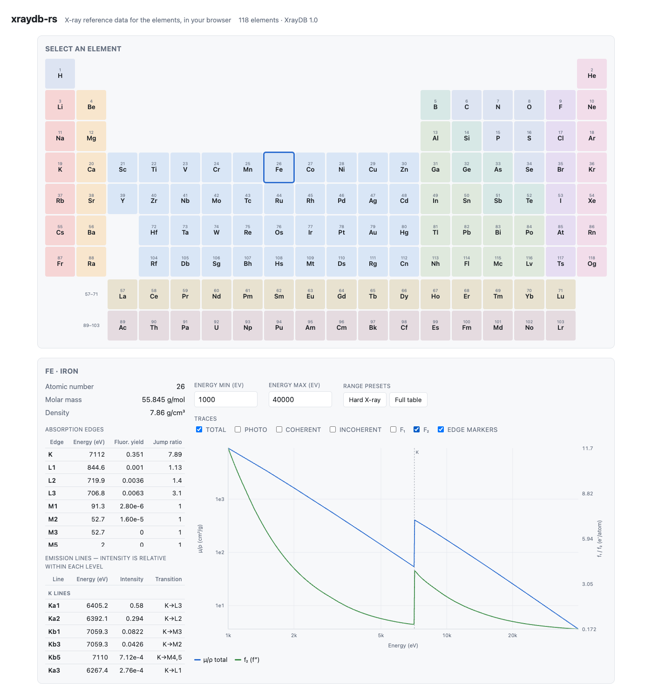

# Browser demo

A dependency-free demo of [`xraydb-wasm`](../xraydb-wasm): periodic-table element
selector, edge and emission-line tables, and live log-log cross-section plots.

## Build and run

From the repository root:

```sh
wasm-pack build --target web --release xraydb-wasm --out-dir ../web/pkg
python3 -m http.server -d web 8080
```

Then open <http://localhost:8080>.

`pkg/` is generated and git-ignored. If it is missing, the page says so and prints the
command to run rather than failing silently.



## What it shows

- **Periodic table** — all 118 elements, coloured by series, keyboard navigable with the
  arrow keys. Elements without tabulated data are dimmed.
- **Element panel** — Z, molar mass, density, every absorption edge (energy, fluorescence
  yield, jump ratio), and the ten strongest emission lines.
- **Cross-section plot** — µ/ρ (total, photoelectric, coherent, incoherent) on a log axis
  plus f₁ and f₂ on a linear right-hand axis, over a user-set energy range. Absorption
  edges are drawn as labelled vertical rules. Hovering reads out the values at that
  energy.

Everything is inline SVG and vanilla ES modules — no charting library, no CDN, no
bundler. The `.wasm` is ~3.5 MB because it embeds the entire compressed database, so the
page works offline once loaded.

## Notes

- Traces are computed with one batched WASM call per trace over a 600-point log-spaced
  grid, not one call per point.
- Energies outside a table's range are clamped by the library; the "Full table" preset
  spans the whole Elam range (100 eV – 800 keV).
